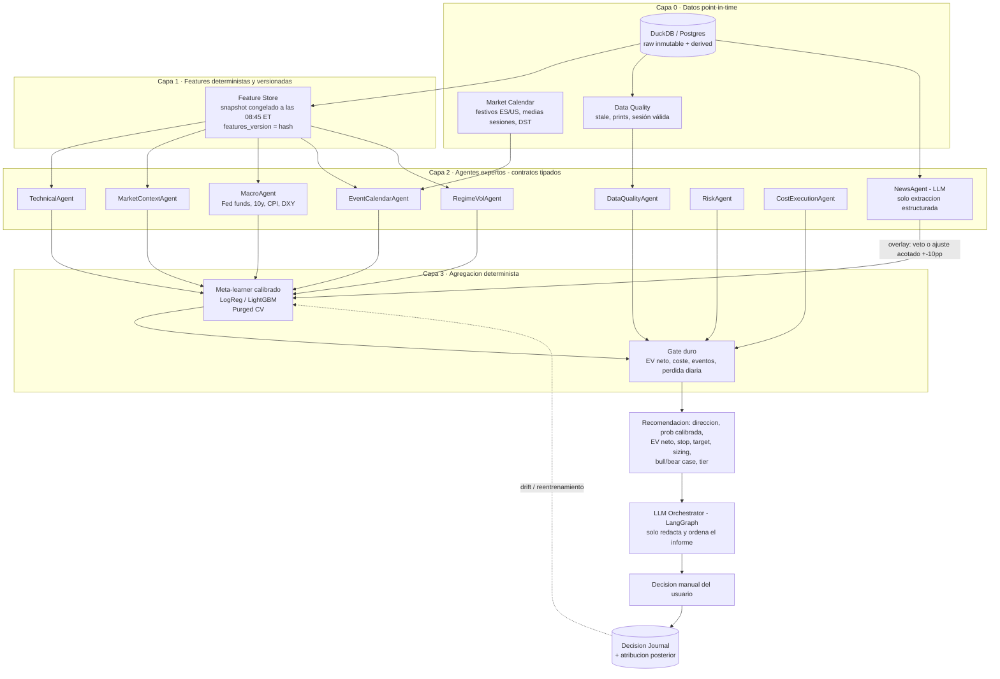

# Plan del proyecto — Sistema multiagente de decisión intradía sobre CFD del S&P 500

| Campo | Valor |
|---|---|
| **Versión** | **2.2** |
| **Fecha** | 2026-09-16 |
| **Estado** | Diseño — pendiente de ejecutar Fase 0 |
| **Instrumento** | **SPX500:CFD**, cotizando en el horario de la sesión regular estadounidense; las horas se calculan en `America/New_York` y se presentan en `Europe/Madrid` |
| **Ámbito** | Decisión de apoyo (*decision support*). La ejecución es siempre manual. |
| **Autor** | Iker (usuario) + asistencia de diseño |

> **⚠️ Cambio de instrumento respecto a la v1.x.** Este plan se redactó inicialmente para el **IBEX 35** y se ha replanteado íntegramente para el **S&P 500**. El cambio no es un renombrado: altera horarios, calendario, fuentes de datos, drivers macro y el horario del flujo diario. La arquitectura (dos vías, gate determinista, arnés de backtest, modelo de persistencia) **se mantiene intacta**. Ver el registro de cambios para el detalle.

> **Aviso.** Este documento es un plan de ingeniería de software, no asesoramiento financiero, fiscal ni de inversión. Las cifras de coste, spread, horarios y requisitos regulatorios son **órdenes de magnitud a verificar por el usuario**. Los CFDs son productos apalancados de alto riesgo; la mayoría de cuentas minoristas pierde dinero operando con ellos.

---

## 0. Cómo usar este documento

- Es la **fuente de verdad** del proyecto. Toda decisión de diseño nueva se refleja aquí antes de implementarse.
- Las secciones **3** y **17** existen específicamente para **prevenir errores de concepto**. Leerlas antes de cada fase.
- Las etiquetas `⚠️ VERIFICAR` marcan datos sensibles al tiempo o al bróker que debes comprobar tú mismo.
- Los cambios al plan se anotan en el **registro de cambios** (final del documento) con fecha y motivo.

---

## 1. Resumen ejecutivo

**Objetivo.** Un sistema en Python que, cada sesión a las **09:00 ET** (15:00 Madrid) —**30 minutos antes de la apertura americana**— produzca una recomendación accionable —`LONG`, `SHORT` o `NOTHING`— sobre `SPX500:CFD`, con:

- Probabilidad **calibrada** de movimiento favorable.
- **Valor esperado neto de costes** (el número que realmente decide).
- Stop y objetivo derivados de la volatilidad prevista.
- Tamaño de posición calculado por riesgo, no por apalancamiento.
- Justificación legible y **contra-argumento** explícito.
- Nivel de confianza (tier) que condiciona si se opera.

**Arquitectura.** Pipeline de agentes expertos que emiten **señales tipadas** numéricas → agregación por **meta-learner determinista calibrado** → **gate duro de riesgo y coste** → síntesis final. El LLM (LangGraph) se usa para **extraer eventos de noticias, explicar y vetar**, nunca para calcular ni para decidir el número.

**Principio rector.** El sistema debe poder decir **"no operar" la mayoría de los días**. El valor principal está en el *no-trade*, la reducción de costes y la gestión de riesgo, no en "predecir el mercado".

**Fase crítica inmediata.** La Fase 0 no construye ningún agente: mide la **tasa base**, el **coste real** de tu CFD y **dónde está el drift del índice**. Es la fase que puede invalidar o reencuadrar el proyecto, y es barata.

### 1.1 Tres hallazgos específicos del S&P 500 con este bróker

El cambio de instrumento y la incorporación de los costes reales introducen tres cuestiones que **deben medirse antes de construir nada**:

**a) La hipótesis del drift nocturno.** Existe evidencia documentada de que una parte desproporcionada del retorno histórico del S&P 500 se genera **fuera** del horario regular de cotización, no en la sesión `open→close`. Si eso se confirma en la muestra, una estrategia intradía larga estaría operando sistemáticamente **la peor parte del día**. La Fase 0 debe comparar explícitamente tres tramos: `open→close` (intradía), `close→open` (nocturno) y `close→close` (total). **Si el `open→close` tiene drift negativo o nulo mientras el nocturno lo tiene positivo, la estrategia debe rehacerse o abandonarse.**

**b) El diferencial es casi nulo, pero la financiación es brutal y asimétrica** (§3.3). El coste de ida y vuelta por el diferencial es de **0,0042 %**, unas 19 veces menos de lo que estimaba este plan. En cambio, mantener **largo una noche cuesta 0,0182 %** (≈6,66 % anualizado) mientras que mantener **corto ingresa 0,0018 %**. Dos consecuencias:
- El listón económico se hunde a **~50,2 %** (§4.4), lo que **traslada toda la dificultad del proyecto al terreno estadístico** (§4.6).
- El baseline «comprar y aguantar un CFD largo» **no es el retorno del índice**: es el índice menos ~6,66 % anual. La estrategia intradía, al estar plano cada noche, **se ahorra ese coste por completo**.

**c) El baseline "siempre largo" exige dos comparaciones distintas, no una.** El S&P 500 tiene un drift positivo fuerte y bien documentado, así que batirlo como *índice* es exigente. Pero como *CFD mantenido* está lastrado por 6,66 % anual de financiación. Son dos listones muy diferentes y hay que evaluar ambos (§11.2).

---

## 2. Principios de diseño (no negociables)

1. **Ningún LLM calcula números.** Indicadores, ratios, probabilidades y volatilidad se calculan en Python determinista. El LLM interpreta texto y redacta.
2. **La decisión es una función pura.** Dados los mismos inputs y la misma versión de modelo, el resultado es byte-a-byte idéntico. Si decidir requiere un LLM en el camino, has perdido el backtest.
3. **Point-in-time o nada.** Ninguna feature puede usar información publicada después del instante de decisión. Todo dato lleva `as_of` y `published_at`.
4. **Los costes se modelan desde el día 1**, no al final. Compras a `ask`, vendes a `bid`.
5. **Nada llega a producción sin backtest walk-forward con purga y embargo, y sin batir a los baselines triviales.**
6. **Toda variante probada se registra.** El sobreajuste se corrige (Deflated Sharpe, PBO), no se ignora.
7. **El LLM tiene derecho a veto y a un ajuste acotado, no a generar alpha.**
8. **El riesgo se define antes de la entrada**: stop, tamaño y pérdida máxima diaria se calculan antes de mirar la dirección.
9. **Criterios de *kill* pre-registrados** antes de ver resultados. No se mueven después.
10. **Reproducibilidad total**: `model_version`, `features_version`, `prompt_hash` y semilla guardados en cada recomendación.
11. **Sin secretos en el repositorio.** Claves de API en `.env` (ignorado por git) o en el gestor de secretos del sistema.
12. **El sistema no opera; recomienda.** Tú decides. Tus anulaciones se registran porque son datos etiquetados gratis.

---

## 3. Glosario y aclaraciones de concepto

> Esta sección existe porque la mayoría de los fallos graves de un proyecto así son **errores conceptuales**, no errores de código.

### 3.1 Índice, futuro y CFD no son lo mismo

| Instrumento | Qué es | Horario / detalle |
|---|---|---|
| **S&P 500 (contado)** | El índice. Es un **número calculado** a partir de 500 acciones ponderadas por capitalización. **No es negociable directamente.** | Sesión regular americana: **09:30–16:00 `America/New_York`** ⚠️ VERIFICAR |
| **Futuro E-mini S&P 500 (ES)** | Contrato negociado en **CME**. Es lo que de verdad se mueve con la oferta y la demanda, y cotiza prácticamente 24h × 5 días. Cotiza con **base** respecto al contado. | Casi 24h. Rueda trimestral (mar/jun/sep/dic) |
| **SPX500:CFD** | Contrato **OTC con tu bróker**. No es un instrumento de mercado. El bróker pone el precio y **él decide el spread**. | **Restricción aceptada provisionalmente:** replica la sesión regular; la ventana exacta se confirma en la tarea 8 |

**Consecuencias prácticas que se ignoran y arruinan backtests:**

- Tu backtest sobre `^GSPC` (índice de contado) **no es exactamente el instrumento que vas a operar**. Hay que medir el **tracking difference** entre la cotización de tu CFD y el índice. Si es comparable a tu edge, el proyecto no tiene sentido tal cual. → **Fase 0.**
- **Ventaja de esta configuración:** si la tarea 8 confirma que el CFD cotiza solo durante la sesión regular, vuelve a existir una **apertura y un cierre operativos**. El diseño `open→close` será directamente aplicable, sin la ambigüedad de un instrumento 24h.
- **El gap nocturno es enorme y contiene toda la sesión europea.** Del cierre a la apertura siguiente hay aproximadamente **17,5 horas**, durante las cuales cotizan Asia y Europa y se publican datos macro americanos. Sus timestamps deben calcularse en UTC/ET, no mediante horas fijas de Madrid. Este *gap* es estructuralmente distinto —y mucho mayor en contenido informativo— que el de un índice europeo. **No se puede tratar como ruido.**
- Los **dividendos de las 500 empresas** afectan al futuro (y por tanto a la referencia del CFD) de forma distinta al índice de contado, con acumulación estacional (mayoría de *ex-dividend* en trimestres concretos).
- El **roll trimestral del futuro ES** introduce un cambio de referencia cuatro veces al año que puede confundirse con un movimiento de mercado.
- El CFD **no tiene un precio "verdadero"**: tiene el precio de tu bróker. Ese es el único precio que existe para tu P&L.

### 3.2 Nomenclatura de precios y ventanas temporales

Definiciones que hay que fijar por escrito porque se mezclan constantemente:

- **`open`**: precio de la **subasta de apertura** de la sesión americana. El `open` **ya incorpora el gap** respecto al cierre anterior, y ese gap contiene 17,5 horas de información.
- **`close`**: precio de la **subasta de cierre** de las 16:00 ET; su hora equivalente en Madrid depende del DST.
- **`open→close`** (intradía puro): mide el movimiento de la sesión americana. Es el horizonte del proyecto.
- **`close→open`** (nocturno): el tramo que la estrategia **no captura**. Puede contener una parte importante del drift total (ver §1.1.a).
- **`close→close`**: retorno total diario. **No es lo mismo** que intradía.
- **`gap`**: `open(t) − close(t−1)`, medido sobre 17,5 horas. Es donde vive gran parte del riesgo y también parte del edge.
- **`overnight`**: mantener posición de un día para otro → aparece **financiación** (*swap*) y **riesgo de gap no cubierto**. **Prohibido en este proyecto** (§12, regla 6).

> **Error de concepto frecuente:** backtestear `close→close` y luego operar intradía `open→close`. Son dos estrategias distintas con P&L distintos, y en el S&P 500 la diferencia entre ambas es especialmente grande.

> **Segundo error, específico de este proyecto:** asumir que el retorno `close→close` del S&P 500 se reparte de forma uniforme entre el día y la noche. Se reparte de forma **muy desigual**, y medirlo es la primera tarea del proyecto.

### 3.3 Costes (el enemigo principal)

Descomposición completa del coste de ida y vuelta:

$$c = \underbrace{\tfrac{1}{2}s_{entry} + \tfrac{1}{2}s_{exit}}_{\text{spread}} + \underbrace{\text{comisión}}_{\text{fijo}} + \underbrace{\text{financiación}}_{\text{si overnight}} + \underbrace{\text{slippage}}_{\text{si mercado rápido/ilíquido}} + \underbrace{\text{fx}}_{\text{si el CFD no es en EUR}}$$

Puntos clave:

- El **spread es proporcional al nocional**, así que escala con tu tamaño y con el apalancamiento. Es el coste dominante.
- La **financiación** no debería aparecer: la estrategia es intradía puro y el CFD solo cotiza en horario de contado. Pero **si no cierras a las 16:00 ET, la posición pasa la noche y sí se cobra**, además de quedar expuesta a un gap de aproximadamente 17,5 horas. Por eso el cierre no es una intención, es un **mecanismo obligatorio** (§12, regla 16). ⚠️ VERIFICAR la hora exacta de corte de tu bróker.
- **El spread no es constante**: se ensancha en la apertura, en el cierre, en eventos macro y **especialmente en los 15 minutos posteriores a la apertura**. Un backtest con spread constante subestima el coste real en los momentos en que más operas.
- **El `close` de tu bróker no es el `close` del índice.** El P&L de tu operación depende del precio que te dé el bróker en el momento de cerrar tú, no del cierre oficial.
- **El CFD es en USD o en EUR según el bróker.** Si el nocional se liquida en otra divisa, hay un coste de conversión que hay que identificar y sumar. ⚠️ VERIFICAR.

### 3.4 Riesgo, apalancamiento y margen

- **Apalancamiento ≠ riesgo.** El riesgo es `distancia_al_stop × nocional`. El apalancamiento es solo una consecuencia.
- **Fórmula correcta de tamaño** (esta es la que se usa en el proyecto):

$$\text{nocional} = \frac{\text{capital} \times \text{riesgo por operación}}{\text{distancia al stop (en \%)}} \qquad \text{apalancamiento} = \frac{\text{nocional}}{\text{capital}}$$

> **Error de concepto frecuente (y caro):** elegir primero el apalancamiento ("uso x5 porque es lo que permite el bróker") y luego improvisar el stop. Es al revés: **el stop determina el tamaño**.
>
> Ejemplo: capital 10.000 €, riesgo por operación 1% (100 €), stop a 1% del precio → nocional = 100 / 0,01 = 10.000 € → apalancamiento 1:1. Si el stop es a 0,5%, el nocional sube a 20.000 € (1:2). Con riesgo constante, **stop más ajustado ⇒ más apalancamiento ⇒ más sensibilidad al slippage y al spread**. No es "gratis".

- **El stop no garantiza el precio.** En un gap o en un hueco de liquidez, tu stop se ejecuta peor. El P&L de cola es peor que el modelado.
- **Margen y cierre forzoso:** con apalancamiento regulado, el bróker cierra tu posición automáticamente al alcanzar un umbral de margen (típicamente 50%). Es decir, **el bróker puede cerrar antes de que llegue tu stop**. ⚠️ VERIFICAR en tu bróker.
- **Riesgo de ruina:** con apalancamiento y sin límite de pérdida diaria, una racha de 5 días malos puede liquidar la cuenta. El límite de pérdida diaria es un requisito, no una opción.

### 3.5 Conceptos de machine learning financiero

| Concepto | Qué significa aquí | Por qué importa |
|---|---|---|
| **Look-ahead bias** | Usar en el snapshot de las 08:45 ET (14:45 Madrid) información publicada a las 09:00 ET, o dar por disponible un dato macro de las 08:30 ET que aún no se ha ingestado | El backtest parece brillante y en real es inservible |
| **Survivorship bias** | Usar la composición **actual** del S&P 500 (hoy muy concentrada en mega-cap tecnológicas) para features históricas de amplitud | ⚠️ **Especialmente grave en este índice:** los pesos sectoriales han cambiado radicalmente en 20 años. Las features quedarían contaminadas de forma severa |
| **Data snooping** | Probar 300 variantes y reportar la mejor | El resultado es ruido estadístico (p-hacking) |
| **Non-stationarity** | Las relaciones cambian con el régimen (tipos, crisis, estructura de mercado) | Un modelo de 2015 puede no valer en 2026 |
| **Calibración** | Que `p=0.6` signifique de verdad ~60% de aciertos | Sin calibrar, el EV y el sizing son basura aunque el ranking sea bueno |
| **Purga y embargo** | Eliminar del train las muestras cuyo horizonte se solapa con el test | Con ventanas móviles, el K-Fold aleatorio filtra información del futuro |
| **Sobreajuste (PBO)** | Probabilidad de que el mejor backtest sea fruto del azar | Con muchos intentos, un Sharpe 1,5 puede ser 0 |
| **Deflated Sharpe Ratio** | Sharpe corregido por número de pruebas y no-normalidad | Evita celebrar un resultado que es ruido |
| **Múltiples horizontes** | Probar 1d, 3d, 5d y quedarse con el que mejor sale | Es snooping disfrazado |

### 3.6 Riesgo, retorno y evaluación

- **Accuracy ≠ rentabilidad.** Un modelo con 60% de acierto puede perder dinero si las pérdidas son mayores que las ganancias. Y al contrario.
- **Alpha vs beta.** El S&P 500 tiene un drift positivo fuerte y bien documentado. Si tu sistema gana un 12% anual estando largo la mayoría de los días y el índice sube un 20%, **no tienes alpha**, tienes beta cara. Hay que separar exposición de mercado de habilidad direccional comparando contra el benchmark y contra "siempre largo" — y en este índice esa comparación es **más exigente** que en un índice lateral.
- **Sharpe y Sortino** como métricas de calidad del retorno ajustado a riesgo, con IC bootstrap.
- **Drawdown máximo** y **tiempo en drawdown** como métricas de tolerabilidad psicológica: si no lo soportas, abandonarás en el peor momento.
- **Tasa base**: cuántos días **sube el S&P 500 en la sesión `open→close`** en tu muestra. ⚠️ **No la asumas.** La tasa base de `close→close` en el S&P 500 es históricamente alcista, pero la de `open→close` es una pregunta empírica abierta y es precisamente lo que mide la Fase 0. Tu modelo debe superar la tasa base de `open→close` de forma significativa, no solo superarla.

---

## 4. Definición formal del problema

### 4.1 Momentos y precios (a fijar una única vez)

**Los eventos se definen en `America/New_York`, se almacenan en UTC y solo se presentan en `Europe/Madrid`. Nunca se deben codificar como horas fijas CET/CEST.**

**El ciclo, en una frase:** el pipeline arranca antes de la apertura, entrega el informe a las **09:00 ET** —30 minutos antes de la subasta— y la operación se abre **en la subasta de apertura** de las 09:30 ET, cerrándose obligatoriamente a las 16:00 ET. Es decir: **estimación antes de abrir, operación dentro de la misma sesión (`open→close`), sin overnight.**

| Elemento | ET (referencia interna) | Madrid (presentación) | Nota |
|---|---|---|---|
| Inicio del pipeline | **08:00** | 14:00 | Ingesta pesada: Asia, Europa en curso, futuros ES, FX |
| Calendario y gate de eventos | **08:15** | 14:15 | FOMC, resultados, OPEX, medias sesiones |
| Publicación macro US | **08:30, si existe** | 14:30 | La hora efectiva se toma del calendario point-in-time |
| **Instante de decisión `t0`** | **08:45** | **14:45** | Se congela el snapshot de features, hasheado |
| **Entrega del informe** | **09:00** | **15:00** | Dirección, probabilidad, EV neto, stop, objetivo, tier y contra-argumento |
| Instante de acción | **09:20–09:30** (manual) | 15:20–15:30 | Deadline duro. La orden debe estar puesta **antes** de la subasta |
| **Apertura de la sesión** | **09:30** | **15:30** | Subasta de apertura. `open` de referencia. **Entrada** |
| Alarma de cierre | **15:45** | 21:45 | Aviso inequívoco: quedan 15 minutos |
| **Cierre de la sesión** | **16:00** | **22:00** | Subasta de cierre. `close` de referencia. **Salida obligatoria** |
| Cierre de registro | **16:15** | 22:15 | P&L, costes efectivos, atribución por agente |

**Duración de la sesión regular: 6,5 horas** (09:30–16:00 ET). La conversión a Madrid depende del DST: en las ~3 semanas de marzo y la ~1 semana de finales de octubre la columna de Madrid **se adelanta una hora** (14:30–21:00). Por eso la referencia interna es siempre la columna ET y la de Madrid es solo presentación.

> ⚠️ **La única casilla de esta tabla que sigue abierta es el precio de entrada exacto**: el `open` de la subasta o tu ejecución real unos minutos después. Lo decide la Fase 0 con el *slippage* medido (§8.5), y está registrado como decisión abierta en §21 (pregunta 7) y en `tech_stack.md` §11 bis (decisión 6). **El resto del calendario queda cerrado aquí.**

**Calendario específico que condiciona todo lo anterior:**

| Situación | Efecto | Tratamiento |
|---|---|---|
| **Desplazamiento por DST** | La hora equivalente en Madrid cambia cuando EE. UU. y Europa cambian de hora en fechas distintas | El scheduler, los costes y las alarmas deben anclarse a `America/New_York`, nunca a una hora local fija |
| **Medias sesiones US** | Cierre a las **13:00 ET** (19:00 Madrid). Día después de Thanksgiving, 24 de diciembre y ocasionalmente el 3 de julio | Sesión de **3,5 h en vez de 6,5 h**. O se normaliza el rango esperado por duración, o se excluyen esos días |
| **Festivos US** | Año Nuevo, MLK, Presidents' Day, Viernes Santo, Memorial Day, Juneteenth, 4 de julio, Labor Day, Thanksgiving, Navidad | No hay sesión. El pipeline no debe emitir recomendación |
| **Roll del futuro ES** | Cuatro veces al año | Puede confundirse con un movimiento de mercado. Debe marcarse como evento |
| **Días de FOMC** | Evento con timestamp oficial en ET | ⚠️ Se marca antes del gate; por defecto no se opera. Ver §12, regla 17 |

> **⚠️ Aviso de DST para el diseño:** durante dos ventanas al año **todos los horarios de esta tabla se desplazan una hora hacia atrás**. Cualquier componente con una hora fija escrita a mano (scheduler, ventanas de features, tramos horarios del modelo de coste, la alarma de cierre) estará mal esos días. La hora de referencia es **siempre la de Nueva York**; la conversión a Madrid es solo de presentación.

### 4.2 Variable objetivo

Hay tres formulaciones posibles. **La elegida debe ser la que se corresponda con la operación real.**

| Formulación | Etiqueta | Problema |
|---|---|---|
| Direccional simple | `y = 1{close > entry}` | Ignora que sales con stop o target; no refleja el P&L real |
| Superar umbral | `y = 1{ret > umbral}` (p. ej. > coste) | Mejor, pero ignora la trayectoria |
| **Tri-barrera** ✅ | `y ∈ {target, stop, tiempo}` | **Alinea la etiqueta con el trade real** (stop, objetivo, tiempo). Es la opción correcta |

**Etiquetado tri-barrera (López de Prado).** Para cada día se simulan tres barreras:
1. **Barrera superior** = entrada × (1 + `target_pct`)
2. **Barrera inferior** = entrada × (1 − `stop_pct`)
3. **Barrera temporal** = cierre de la sesión (16:00 ET, o **13:00 ET en medias sesiones**)

Se observa qué barrera se toca primero (usando datos intradía para el orden, no solo el OHLC diario). La etiqueta es la barrera tocada. Esto permite al modelo predecir **exactamente el resultado de la operación que vas a hacer**.

`target_pct` y `stop_pct` deben ser **proporcionales a la volatilidad prevista** (por ejemplo, múltiplos del ATR o de la desviación típica condicional), no constantes.

### 4.3 Métrica de decisión: valor esperado neto

$$EV = p_{win}\cdot \mathbb{E}[G] - (1-p_{win})\cdot \mathbb{E}[P] - c$$

Se opera **solo si `EV > umbral_de_seguridad`** (p. ej. `EV > 2 × c`), y también solo si el tier de confianza lo permite.

### 4.4 La condición de break-even y el ratio coste/movimiento

Con un bracket simétrico de amplitud $\pm R$ y coste de ida y vuelta $c$ (en unidades de retorno):

$$p^* = \frac{R + c}{2R}$$

**Con el coste real declarado** (§3.3), y suponiendo que se cumple el intradía puro sin noche (`c = 0,0042%`):

| $R$ (amplitud del bracket) | $p^*$ con $c = 0{,}0042\%$ | $p^*$ con $c = 0{,}0224\%$ (una noche, largo) |
|---|---|---|
| 0,5 % | **50,42 %** | 52,24 % |
| 1,0 % | **50,21 %** | 51,12 % |
| 1,5 % | **50,14 %** | 50,75 % |

$$p^*_{intradía}(R = 1\%) = \frac{0{,}010 + 0{,}000042}{2 \times 0{,}010} = \mathbf{50{,}21\%}$$

> **El listón económico ha desaparecido casi por completo.** Se pasa de necesitar ~54 % (con la estimación previa de 0,08 %) a necesitar **~50,2 %**. La barra económica deja de ser el problema. **Lo que ocurre es que el problema se traslada íntegro al terreno estadístico: ver §4.5 y §4.6.**

**Lo que sigue importando del coste:**

1. Con $c$ tan bajo, **el término dominante deja de ser el diferencial y pasa a ser el *slippage***. 20 pb de *slippage* pesan **cincuenta veces** más que el diferencial. Medirlo es ahora la prioridad absoluta de la Fase 0.
2. **La asimetría del carry sigue siendo relevante como riesgo de disciplina**, no como coste planificado: si un día no cierras, en un largo pagas 0,0182 % por la noche (5× el diferencial) más un *gap* de 17,5 horas. En un corto, ese mismo descuido no te cuesta tenencia.
3. **Un $p^*$ de 50,2 % es peligrosamente bajo como criterio de viabilidad.** Cualquier modelo con un sesgo mínimo parece rentable. Ver §4.6.

**Conclusiones operativas:**

1. Con el diferencial real (0,0042 %) el listón está en **~50,2 %**. Con el coste de una noche mal cerrada (0,0224 %) sube a **~51,1 %**, y en un largo además con *gap*.
2. La palanca del coste ya está agotada: no hay margen para "mejorar de bróker" porque **el diferencial es de 0,42 pb, prácticamente un *tick* de futuro**. Queda una sola palanca real: **aumentar $R$** (objetivos más amplios, menos operaciones) y **operar menos días**.
3. ⚠️ **Se invierte una de las recomendaciones de la v1.x.** Con el IBEX, "cambiar de bróker" era la mejora con mejor retorno. Con estos costes, **esa palanca ya no existe**: el diferencial está en el mínimo estructural del instrumento. La única mejora de coste que queda es **no pagar financiación**, es decir, **cumplir el cierre a las 22:00**.

### 4.5 ¿Cuántas operaciones necesitas? (potencia estadística)

Con `p = 0,55` real y pagos simétricos, se puede calcular la probabilidad de **perder dinero tras N operaciones** (media $N(2p-1)$, desviación $2\sqrt{Np(1-p)}$):

| N operaciones | P(perder dinero pese al edge real) |
|---|---|
| 100 | ≈ 16% |
| 200 | ≈ 8% |
| 400 | ≈ 2% |

**Implicaciones de concepto:**

- Con **menos de ~200–400 operaciones no puedes distinguir un edge real del azar**. Un drawdown de 10 operaciones seguidas perdedoras es **estadísticamente normal**, no una señal de que el sistema se ha roto.
- Con ~250 sesiones/año y operando solo el **20–30%** de los días (tier A), en 5 años acumulas ~250–375 operaciones. **Es el mínimo absoluto.**
- Corolario: **modelos simples, pocas features, fuerte regularización**. Cada parámetro extra que añadas cuesta poder estadístico que no tienes.

**El problema, cuantificado con el coste real.** Ahora que $p^* \approx 50{,}2\%$, la pregunta deja de ser "¿puedo superar el coste?" y pasa a ser "**¿puedo demostrar que lo supero?**". Para distinguir un edge real de $p = 0{,}52$ frente a $p_0 = 0{,}50$, con 95 % de confianza y 80 % de potencia:

$$n = \frac{(z_{\alpha/2} + z_\beta)^2 \cdot p(1-p)}{(p - p_0)^2} = \frac{(1{,}96 + 0{,}84)^2 \times 0{,}2496}{0{,}02^2} \approx \mathbf{4.892 \text{ operaciones}}$$

| Edge real a detectar | Operaciones necesarias | Años al ritmo de 250/año |
|---|---|---|
| $p = 0{,}55$ | ~450 | ~2 años |
| $p = 0{,}53$ | ~1.100 | ~4,5 años |
| **$p = 0{,}52$** | **~4.900** | **~20 años** |
| $p = 0{,}51$ | ~19.600 | inviable |

Y al revés: con **300 operaciones** y un $p$ observado de 0,52, el intervalo de confianza al 95 % es $[0{,}463;\ 0{,}576]$, que **contiene el 0,50**. Es decir: **con la muestra de la que vas a disponer, un edge del 52 % es indistinguible del azar.**

---

## 4.6 ⭐ El traslado de la dificultad: del coste a la estadística

La incorporación de los costes reales (§3.3) **mejora mucho la economía del proyecto pero empeora su verificabilidad**. Es el cambio conceptual más importante de esta revisión y conviene tenerlo explícito.

| | Antes (con $c = 0{,}08\%$) | Ahora (con $c = 0{,}0042\%$) |
|---|---|---|
| Coste por operación | 8 pb | **0,42 pb** |
| $p^*$ a superar | ~54 % | **~50,2 %** |
| Edge necesario para ser rentable | Grande | **Diminuto** |
| Edge necesario para ser *demostrable* | Grande | **Grande (no cambia)** |

> **La paradoja central del proyecto:** con costes casi nulos, **casi cualquier sesgo mínimo es rentable**, pero un sesgo mínimo es **precisamente lo que no puedes demostrar** con 250–400 operaciones.

**Las tres consecuencias que hay que asumir:**

1. **Un $p^*$ de 50,2 % no es un criterio de viabilidad útil.** Ya no sirve como puerta de salida, porque cualquier modelo sesgado lo supera. La puerta de salida debe ser **estadística**, no económica: ver §11.6.
2. **El sistema no puede validarse por resultado.** En el horizonte temporal razonable, el P&L realizado **no distinguirá** una estrategia con edge del 52 % de una sin edge. Cualquier conclusión de "funciona" basada en 3 o 6 meses de operación será **ruido**.
3. ⚠️ **Consecuencia de diseño, y es contraintuitiva:** si no puedes validar la dirección por resultado, **el valor verificable del sistema se mueve a las partes que sí son medibles** — la volatilidad (que sí es predecible y verificable), la gestión de riesgo, el filtrado de días malos y el cumplimiento del proceso. **Es coherente con §5: los edges (a), (b) y (c) son reales y verificables; el (d) no.**

**Qué hacer con esto, en la práctica:**

- **No relajar los criterios por tener costes bajos.** Al contrario: al desaparecer la barrera económica, **la disciplina estadística es lo único que separa este proyecto de la autoindulgencia**.
- **Mantener el listón alto en §11.6** aunque $p^*$ sea bajo. El criterio no es "¿es rentable?", sino "¿hay evidencia de que haya un edge?", y son preguntas distintas.
- **Aceptar honestamente el escenario más probable:** el sistema producirá recomendaciones, tú las seguirás con disciplina, y **durante mucho tiempo no sabrás si funcionan**. El valor estará en el proceso, no en el resultado medible a corto plazo. Si eso no es aceptable, hay que replantear el proyecto.

---

## 5. ¿De dónde puede venir el edge? (expectativa realista)

Enumeración honesta. Los dos primeros son reales y alcanzables; el último es el que todo el mundo persigue y casi nadie consigue.

**a) Edge de coste / ejecución** ✅ *el más fiable — pero ya explotado*
Con un diferencial de 0,42 pb (§3.3), este edge **ya está capturado de antemano**: el bróker te lo da casi gratis. Queda solo el *slippage*, es decir, ejecutar bien en la apertura. Es un edge de disciplina, no de infraestructura.

**b) Edge de gestión de riesgo** ✅ *el segundo más fiable*
No operar en días de evento, dimensionar según volatilidad, límites de pérdida, stops coherentes, disciplina. La mayoría de las cuentas minoristas no pierden por falta de predicción, sino por mala gestión del riesgo y sobreoperación.

**c) Edge de volatilidad** ✅ *robusto y documentado*
La volatilidad es **predecible** (clustering, GARCH, HAR). No te dice la dirección, pero te dice **cuándo es rentable operar y de qué tamaño**. Es el uso más eficiente de la estadística en este proyecto.

**d) Edge direccional débil** ⚠️ *posible, pequeño, frágil*
Reversión tras gaps extremos, momentum intradía de corto plazo, efectos de calendario (OPEX, triple *witching*, roll del ES, **días de resultados de mega-caps**), estacionalidad. Aquí sí puede haber algo, pero será una probabilidad de 52–56%, no de 80%. Y hay que demostrarlo con purga.

> **Nota específica del S&P 500:** hay una familia de efectos de calendario documentados en este índice que no existen (o son mucho más débiles) en índices europeos, ligados a la concentración de vencimientos de opciones y a la estacionalidad de flujos. Merecen una revisión explícita en la Fase 2, **con la advertencia de que son el terreno abonado para el *data snooping***: hay cientos de efectos de calendario publicados y encontrar uno que "funciona" en tu muestra es casi garantizado por azar.

**e) Edge informativo sobre noticias** ❌ *muy improbable para un retail*
Competir en velocidad de reacción a noticias contra fondos con datos de pago y co-location es perder. Lo útil no es "reaccionar antes", es **identificar cuándo NO operar** porque hay un evento material. Ese es el uso correcto del NewsAgent.

> **Encuadre correcto del proyecto:** no es "un oráculo que predice el S&P 500", es un **sistema de filtrado y control de riesgo que selecciona los pocos días en los que la relación movimiento/coste es favorable y decide un sesgo direccional débil** en esos días.

---

## 6. Arquitectura

### 6.1 Vista general



### 6.2 La regla de oro: dos vías, no una

El error de diseño más común es **meter todo bajo un orquestador LLM**. Dos motivos:

1. **Los LLM no calculan.** Alucinan números. Todo lo numérico va en Python.
2. **Un agente LLM no es retrotesteable.** No hay archivo histórico de noticias con timestamp exacto (cuesta dinero) y, aunque lo hubiera, el LLM cambia entre versiones → backtest no reproducible. Además el propio LLM introduce look-ahead si no se controla el `published_at`.

**Diseño:**

- **Vía cuantitativa (determinista, backtesteable):** features → meta-learner → probabilidad calibrada → gate → decisión.
- **Vía LLM (no backtesteable, con poder limitado):** extracción de eventos, redacción del informe, y **veto**. Ajuste máximo de **±10 puntos porcentuales** sobre la probabilidad del meta-learner.

> **Regla de oro:** la vía LLM tiene derecho a **veto** y a un **ajuste acotado**; **no** tiene derecho a generar alpha hasta que se demuestre estadísticamente que lo genera (incremento significativo del Brier score y del Sharpe OOS con el veto activo).

### 6.3 Capas

| Capa | Responsabilidad | Criterio de aceptación |
|---|---|---|
| 0 · Datos | Ingesta, almacenamiento inmutable, point-in-time, calendario, calidad | Todo dato tiene `as_of` y `source`. Reproducible desde raw |
| 1 · Features | Cálculo determinista, versionado, sin look-ahead | Mismo input ⇒ mismo hash. Test de golden dataset |
| 2 · Agentes | Señales tipadas con evidencia trazable | Contrato Pydantic validado; ningún agente devuelve prosa |
| 3 · Agregación | Meta-learner calibrado + gate duro | Función pura, sin red, < 50 ms, determinista |
| 4 · Presentación | Informe en lenguaje natural + entrega | LLM solo transforma datos ya calculados |
| 5 · Evaluación | Backtest, walk-forward, paper, atribución | Ver §11 |

---

## 7. Agentes: catálogo y contratos

### 7.1 Catálogo

| Agente | Origen | Salida (contrato tipado, nunca prosa) |
|---|---|---|
| **TechnicalAgent** | Propuesto | `trend_score`, `rsi`, `atr_norm`, `dist_to_ma`, `vol_breakout`, `soportes/resistencias` |
| **MarketContextAgent** | Propuesto | `corr_rolling` SPX~DAX/FTSE/SX5E/Nikkei, `beta_vix`, `Δdxy`, `sesion_europea_previa`, `asia_overnight`, `dispersion_sectorial` |
| **MacroAgent** | Propuesto | `fed_funds`, `Δfed_funds_esperado`, `ust_10y`, `Δust_10y_5d`, `pendiente_2s10s`, `cpi_yoy`, `dxy`, `sorpresa_macro_hoy` |
| **NewsAgent (LLM)** | Propuesto | `list[Event{entity, direction, materiality, horizon, source, published_at, confidence}]` + veto |
| **RiskAgent** | Propuesto | `sigma_forecast`, `expected_range`, `gap_risk`, `prob_stop_hit`, `max_daily_loss_ok`, `kill_switch` |
| **Orquestador** | Propuesto | Ver §7.3 — híbrido |
| **EventCalendarAgent** | ⭐ **añadido** | OPEX, triple *witching*, roll del ES, días de FOMC, publicaciones macro (CPI/PCE/NFP/ISM), **resultados de mega-caps**, medias sesiones. **Fuente principal de "NOTHING"** |
| **RegimeVolAgent** | ⭐ **añadido** | Percentil de ATR realizado, régimen tendencia/rango, forecast GARCH/HAR. **La volatilidad sí es predecible** |
| **CostExecutionAgent** | ⭐ **añadido · el más rentable** | Spread real observado, comisión, coste de conversión de divisa, slippage estimado, **ratio `movimiento_esperado / coste`** |
| **SizingAgent** | ⭐ **añadido** | Fracción de Kelly corregida (¼–½), nocional, riesgo por operación |
| **DataQualityAgent** | ⭐ **añadido** | Sesión válida, dato *stale*, print erróneo, gaps de datos |
| **EvaluatorAgent** | ⭐ **añadido · se construye PRIMERO** | Backtest, purga/embargo, PBO, Deflated Sharpe |
| **AttributionAgent** | ⭐ **añadido** | Post-mortem diario: ¿qué agente acertó/falló? Bucle de I+D |
| **DevilAdvocateAgent** | ⭐ **añadido** | Genera el caso contrario a la recomendación → evita anclaje |

**Nota específica del S&P 500:** el índice está **muy concentrado en mega-cap tecnológicas** —las mayores posiciones superan con holgura el 30% del peso agregado—, lo que tiene tres consecuencias directas sobre las features:

1. **Los tipos a largo plazo son un driver estructural.** El sector tecnológico es sensible a la duración, así que el rendimiento del Treasury a 10 años y su variación reciente son una familia de features con fundamento económico, no un adorno. El `MacroAgent` se justifica en `ust_10y` y en la pendiente de curva, no en tipos a corto europeos.
2. **El dólar y el petróleo también pesan.** El DXY afecta a las multinacionales y el crudo al sector energético, que es un peso relevante. Ambos son series gratuitas y líquidas.
3. **El calendario de resultados de las mayores posiciones es un evento de primer orden.** Una sola mega-cap publicando puede mover el índice más que cualquier dato macro. El `EventCalendarAgent` debe incorporarlo explícitamente.

⚠️ **El sesgo de supervivencia aquí es más grave que en un índice europeo**: los pesos sectoriales del S&P 500 han cambiado radicalmente en dos décadas. Usar la composición **actual** para construir features históricas de amplitud produciría un backtest gravemente contaminado. **Solución adoptada: usar ETFs sectoriales** (tecnología, financiero, energía, salud, consumo, industrial, utilities, materiales, inmobiliario, comunicaciones) como proxies, en lugar de amplitud de constituyentes. Son series líquidas, gratuitas, con historia larga y **sin sesgo de composición**.

### 7.2 Contratos de datos

```python
from datetime import date
from enum import Enum
from pydantic import BaseModel, Field


class Direction(str, Enum):
    LONG = "long"
    SHORT = "short"
    NOTHING = "nothing"


class AgentSignal(BaseModel):
    agent: str
    as_of: str                        # ISO 8601 con TZ. Guardar en UTC, presentar en Europe/Madrid
    features_version: str             # hash del feature set
    prob_up: float = Field(ge=0, le=1)   # solo si el agente es direccional
    confidence: float = Field(ge=0, le=1)
    veto: bool = False
    veto_reason: str | None = None
    evidence: dict = {}               # valores numéricos crudos y trazables


class NewsEvent(BaseModel):
    entity: str                       # "SPX500", "NVDA", "FED", "DXY", ...
    direction: int                    # -1 / 0 / +1
    materiality: float = Field(ge=0, le=1)
    horizon_hours: int
    source: str
    url: str
    published_at: str                 # CRÍTICO: debe ser <= as_of de la decisión
    llm_confidence: float = Field(ge=0, le=1)


class Recommendation(BaseModel):
    trade_date: date
    direction: Direction
    prob_up_calibrated: float
    expected_move_pct: float
    cost_pct: float                   # ida + vuelta, MEDIDO
    ev_net_pct: float                 # el número que decide
    size_notional_eur: float
    size_fraction_of_capital: float
    leverage_implied: float
    entry_ref: float
    stop_pct: float
    target_pct: float
    blocking_events: list[str]
    bull_case: list[str]
    bear_case: list[str]
    confidence_tier: str              # "A" | "B" | "C"
    model_version: str
    features_version: str
    prompt_hashes: dict[str, str]
```

### 7.3 El orquestador: comparativa y elección

| Opción | Pros | Contras |
|---|---|---|
| (a) Voto ponderado de agentes | Transparente, backtesteable | Lineal, no captura interacciones, pesos arbitrarios |
| (b) Meta-learner (stacking) | Captura interacciones, calibrable, determinista | Caja negra, riesgo de sobreajuste |
| (c) LLM decide todo | Flexible, buena explicación | **No backtesteable, no reproducible, alucina números** |

**Elección: (b) + (c) como capa de explicación y veto.**

```
1. Los agentes producen señales tipadas (números, no texto).
2. Un meta-learner (regresión logística regularizada o LightGBM pequeño + calibración)
   toma las señales y devuelve P(subida) calibrada. Entrenado con Purged CV.
3. El NewsAgent LLM aplica un overlay: veto binario o ajuste acotado a ±10pp,
   con su justificación trazada (published_at verificado).
4. El Gate duro (determinista, función pura) decide:
       EV > umbral  AND  coste OK  AND  sin evento bloqueante
       AND  límite de pérdida diaria OK  AND  tier autorizado
   → LONG / SHORT / NOTHING
5. El LLM Orchestrator (LangGraph) NO decide: redacta el informe,
   ordena los argumentos, presenta el contra-argumento y el tier de confianza.
6. Human-in-the-loop: tú decides. Y registras si anulaste la recomendación y por qué.
```

**Uso de LangGraph:** orquesta el *pipeline* (fetch → nodos expertos en paralelo → fan-in → síntesis), con `state` tipado por Pydantic, `checkpointer` para persistencia e `interrupt` para el punto de decisión humana. El paso 4 debe ser **una función pura de Python** invocable en un backtest en milisegundos con resultado idéntico cada vez.

### 7.4 Guardarraíles del LLM

- `temperature = 0`.
- **Salida estructurada obligatoria** (esquema Pydantic). Si no valida, se descarta el evento.
- **Caché de respuestas** con clave = hash(prompt + modelo + inputs) → reproducibilidad y ahorro.
- Registro de `model_id` y `prompt_hash` en cada recomendación.
- **El LLM no ve el resultado**: no se le da información posterior al `as_of`.
- **El LLM no puede inventar features**: solo recibe los valores ya calculados y los cita.
- Límite de gasto y de latencia por ejecución; si el LLM falla o tarda, el pipeline **continúa sin overlay** (degradación grácil, nunca bloqueo).

---

## 8. Datos

### 8.1 Fuentes gratuitas

| Necesidad | Fuente gratuita | Nota importante |
|---|---|---|
| S&P 500 diario | `yfinance` (`^GSPC`), **Stooq** | Histórico de décadas, gratuito y fiable |
| S&P 500 intradía | `yfinance` (`^GSPC` 1m ~7 días, 5m ~60 días), Alpha Vantage, Twelve Data | 🟢 **Ventaja frente al IBEX: sí hay intradía gratuito del S&P 500.** Con 5m hay material suficiente para el rango de la sesión |
| Futuro E-mini ES | `yfinance` (`ES=F`) | Referencia real del subyacente del CFD y de la base |
| ETF SPY | `yfinance` (`SPY`) | Verificación cruzada de precios y volúmenes reales |
| **Sectores (proxies)** | **ETFs sectoriales**: `XLK`, `XLF`, `XLE`, `XLV`, `XLY`, `XLP`, `XLI`, `XLU`, `XLB`, `XLRE`, `XLC` | ⭐ **Solución al sesgo de supervivencia** (§7.1). Historia larga, líquidos, sin sesgo de composición |
| Volatilidad | `yfinance` (`^VIX`, opcional `^VIX9D`, `^VVIX`) | ⭐ **El VIX es un índice real y líquido**, no un proxy |
| Tipos y macro US | **FRED API** | Fed funds, UST 2y/10y, pendiente, CPI, PCE, NFP. **Fuente primaria del proyecto** |
| Macro europa (contexto) | ECB Data Portal / SDW, Eurostat | Solo como contexto de la sesión europea previa. **Ya no es la columna vertebral** |
| Índices de contexto | `yfinance`: `^GDAXI`, `^FTSE`, `^STOXX50E`, `^N225`, `^HSI` | Europa (sesión previa) y Asia (nocturna) |
| FX y commodities | `yfinance`: `DX-Y.NYB`, `EURUSD=X`, `BZ=F`, `CL=F`, `GC=F` | DXY es driver directo por las multinacionales |
| Noticias (amplio) | **GDELT** (gratis, enorme), RSS de Reuters / CNBC / MarketWatch / Investing / Seeking Alpha | GDELT para eventos macro-geopolíticos; RSS americano para lo relevante al índice |
| Noticias + sentimiento | Marketaux, Finnhub, Alpha Vantage News Sentiment, FMP | Tiers gratuitos limitados; suficiente para el overlay |
| **Resultados (*earnings*)** | Calendario público + `yfinance` | ⚠️ **Crítico en este índice**: una mega-cap mueve más que un dato macro |
| Posicionamiento | CFTC COT (gratis) | Sí hay datos directos para ES, a diferencia del IBEX |

> **Cambio de peso entre fuentes:** con el IBEX, el ECB SDW era la fuente canónica de tipos y el Euribor la variable clave. Con el S&P 500, **FRED pasa a ser la fuente primaria** y ECB queda como contexto europeo opcional. Además, la restricción de datos intradía que bloqueaba la Fase 0 **desaparece**.

### 8.2 Almacenamiento y point-in-time

- **Raw inmutable** (append-only) + **derived** recalculable. Nunca sobrescribir raw.
- Todo registro con: `source`, `fetched_at`, `as_of`, `published_at` (si aplica), `version`.
- DuckDB + Parquet si es una sola máquina (recomendado para empezar); Postgres + TimescaleDB si se necesita concurrencia.
- **Snapshots de features congelados y hasheados** por día. Si el hash cambia, cambia la `features_version` y hay que re-evaluar.
- **Reconstrucción reproducible**: poder regenerar cualquier día del histórico desde el raw.

### 8.3 Calendario, festivos y DST

- **Festivos de Estados Unidos** (el mercado objetivo): Año Nuevo, MLK, Presidents' Day, Viernes Santo, Memorial Day, Juneteenth, 4 de julio, Labor Day, Thanksgiving, Navidad. Los festivos españoles **solo** importan para tu disponibilidad para operar, no para el mercado.
- **Medias sesiones US**: cierre a las 13:00 ET. La hora equivalente en Madrid depende del DST. La sesión dura **3,5 h en vez de 6,5 h** → o se normaliza el rango esperado por duración, o se excluyen.
- **Cambio horario (DST)** — ⚠️ **es un problema directo, no de solape**. EE. UU. y Europa cambian en fechas distintas. **Toda hora fija escrita a mano queda mal esos días**: el scheduler, la alarma de cierre, los tramos horarios del modelo de coste y las ventanas de features.
  - **Regla de diseño:** la hora de referencia es **siempre `America/New_York`**. La conversión a `Europe/Madrid` es **solo para presentación**. Guardar todo en UTC.
- **Roll del futuro ES**: cuatro veces al año. Marcar como evento; puede confundirse con un movimiento de mercado.
- **Días de FOMC**: usar el timestamp oficial del evento en ET/UTC y marcarlo antes del gate. Ver §12, regla 17.
- **Subastas**: apertura a las 09:30 ET y cierre a las 16:00 ET. Los precios de referencia son los de subasta.
- `EventCalendarAgent` consume este calendario; el `Gate` lo usa como bloqueo.

### 8.4 Calidad de datos

Checks mínimos antes de calcular features:

- ¿Es día de sesión válido? ¿Media sesión?
- ¿Faltan barras? ¿Hay huecos no justificados?
- ¿Precios *stale* (mismo valor repetido N veces)?
- ¿Prints anómalos (saltos > Xσ sin evento)?
- ¿El dato es de hoy o de ayer por un fallo de la API?
- ¿Coherencia entre fuentes (`^GSPC` de Yahoo vs Stooq vs `SPY` vs `ES=F`)?
- ⚠️ **¿El dato macro de las 08:30 ET ha llegado y se ha ingestado antes del snapshot de las 08:45 ET?** Si no, la decisión del día es sospechosa

Si falla la calidad → **`NOTHING` automático**. Nunca operar con datos dudosos.

### 8.5 Mediciones previas obligatorias (Fase 0)

| Medición | Cómo | Por qué |
|---|---|---|
| **Confirmar la ventana del CFD** | Comprobar en el bróker la ventana real de `SPX500:CFD` en ET y anotar sus timestamps UTC de apertura y cierre | Toda la definición del problema depende de esto |
| ⭐ **Hora exacta de corte de la financiación** | Preguntar al bróker en qué instante cobra el «coste de tenencia» | ⚠️ **Es la verificación más crítica de la Fase 0.** Si el corte cae antes de las 16:00 ET, el intradía puro pagaría tenencia igualmente |
| **Verificar el diferencial declarado** | Contrastar el 0,0042 % del documento con `ask − bid` en vivo antes de la subasta (09:20 ET), recién abierto (09:35 ET), al mediodía (11:00 ET), antes del cierre (15:45 ET) y en el cierre (16:00 ET) | El documento es regulatorio, no una cotización. **El diferencial en la apertura suele ser bastante más ancho** |
| ⭐ **Medir el *slippage* real** | Anotar el precio que obtienes frente al precio de referencia en el momento de tu orden, repetido 10–15 veces | **Es ahora el coste dominante y el único no declarado.** Con un diferencial de 0,42 pb, 20 pb de *slippage* pesan **cincuenta veces más** |
| **Cómo escala el diferencial con el tamaño** | Probar con importes menores y verificar que no aparece un mínimo de comisión o de spread en puntos | Las cifras son sobre 10.000 $ de nocional. ⚠️ En cuentas pequeñas el porcentaje real puede ser mucho mayor |
| **Tracking difference CFD vs `^GSPC`** | Comparar la cotización del CFD y el índice en vivo, 5–10 sesiones, cada minuto | Si es comparable al edge, el proyecto no es viable |
| **Divisa de denominación y liquidación** | Comprobar si el CFD está en EUR, en USD, o cubierto de divisa de forma implícita | El documento declara 0,00 % de cambio de divisa: confirmar de dónde sale ese cero |
| **Hora efectiva de entrada/salida** | Comparar tu hora de ejecución real con el precio de referencia | El *slippage* humano existe, y aquí entras en la apertura, que es el momento más difícil |
| **Tasa base `open→close`** | % de sesiones alcistas, distribución de `open→close`, movimiento medio | Define $p^*$ y si el proyecto es viable |
| ⭐ **Descomposición del drift** | Comparar el retorno medio de **`open→close`** contra **`close→open`** y contra **`close→close`**, por tramos de volatilidad y por año | **Es la medición decisiva del proyecto** (§1.1.a): si el drift está concentrado en el tramo nocturno, la estrategia intradía está operando sistemáticamente la peor parte del día |
| **Duración efectiva de la sesión** | Horas reales por sesión, marcando medias sesiones | 6,5 h normal frente a 3,5 h en medias sesiones: afecta al rango esperado |

---

## 9. Ingeniería de features

**Familias:**

1. **Técnicas**: retornos multi-ventana, ATR normalizado, distancia a medias, RSI/estocástico, posición en rango, rupturas de volatilidad.
2. **Contexto de mercado**: correlaciones rodantes con DAX/FTSE/SX5E, comportamiento del Nikkei y Hang Seng en la sesión nocturna, sesión europea previa (que ocurre **dentro del gap**), retorno del S&P 500 del día anterior, dispersión sectorial vía ETFs, beta al VIX.
3. **Macro**: nivel y variación de la Fed funds, UST a 10 años y a 2 años, pendiente 2s10s, inflación (CPI y PCE), DXY, sorpresas macro del día.
4. **Régimen**: percentil de volatilidad realizada, régimen tendencia/rango, forecast de volatilidad condicional (GARCH/HAR).
5. **Calendario**: día de la semana, proximidad a OPEX/vencimiento/rebalanceo, clustering de eventos.
6. **Microestructura / coste**: spread observado, liquidez relativa por tramo horario, ratio movimiento/coste.

**Reglas:**

- Todas normalizadas de forma **robusta** (z-score sobre ventana expandida o mediana/MAD), nunca sobre el conjunto completo de la muestra (**eso sería look-ahead**).
- Features **poco correlacionadas**; eliminar redundancia (VIF alto ⇒ inestabilidad).
- Ninguna feature calculada con datos posteriores al `t0`.
- Documentar cada feature: nombre, fórmula, ventana, fuente, `as_of` requerido.
- Test de **golden dataset**: un conjunto fijo de inputs con output esperado, para detectar cambios silenciosos.

**Advertencia sobre el número de features:** con ~250–375 operaciones útiles, **más de ~10–15 features es temerario**. La regularización y la selección no arreglan la falta de datos.

---

## 10. Modelado y calibración

| Aspecto | Decisión |
|---|---|
| Algoritmos iniciales | Regresión logística regularizada (baseline); LightGBM pequeño (comparación) |
| Calibración | **Obligatoria**: isotónica o Platt, ajustada **dentro** del esquema de purga |
| Métricas de probabilidad | **Brier score** y **log-loss** (no accuracy) |
| Métricas de trade | EV neto, Sharpe/Sortino, hit rate × payoff, drawdown máximo |
| Selección de modelo | Walk-forward con purga + embargo; nunca K-Fold aleatorio |
| Reproducibilidad | Semilla fija, versiones pinneadas, hash de features |
| Baseline obligatorio | "No hacer nada" y "siempre largo" |

**Sobre Kelly y el sizing:**

$$f^* = \frac{p\,b - q}{b} \qquad \text{con pagos simétricos } (b=1): \; f^* = 2p - 1$$

- Con `p = 0,55` → `f* = 10%` del capital. **Pero Kelly asume que tu `p` es exacto**, y no lo es.
- Con error de estimación, Kelly completo es arriesgado → usar **¼ o ½ Kelly**.
- **Kelly fraccional sobre el riesgo**, no sobre el nocional. El nocional sale de la fórmula de §3.4.
- Nunca usar Kelly para justificar apalancamiento alto. La restricción práctica es el **límite de pérdida diaria**.

---

## 11. Protocolo de evaluación y backtesting

> **Esta sección se implementa ANTES que los agentes.** Es la parte que decide si el proyecto tiene sentido.

### 11.1 Purga y embargo

- Ventanas de train/test no se solapan: **purga** las muestras de train cuyo horizonte de etiqueta se solapa con el test.
- **Embargo** de N días (típicamente 1–5% del tamaño de la muestra) tras cada bloque de test, para eliminar autocorrelación residual.
- **Nunca** `train_test_split` aleatorio ni K-Fold estándar.

### 11.2 Baselines que hay que batir

| Baseline | Descripción |
|---|---|
| **No operar** | Sharpe = 0. **El baseline más difícil de batir neto de costes** |
| Siempre largo | Compra a la apertura, vende al cierre, todos los días |
| Siempre corto | Espejo del anterior |
| Momentum 5d | Sesgo largo si el retorno de 5 días es positivo |
| Reversión de gap | Sesgo contrario al gap de apertura |
| Regla aleatoria con la misma frecuencia | Control de significación estadística |

Si tu pipeline no bate **"no operar"** y **"siempre largo"** de forma estadísticamente significativa, el proyecto no debe pasar a producción.

> **⚠️ Advertencia específica del S&P 500:** el S&P 500 tiene un drift positivo documentado, así que superar al *índice* es exigente. Pero aquí hay que separar **tres listones distintos**, y confundirlos invalida el análisis:
>
> | Baseline | Qué paga | Retorno esperado |
> |---|---|---|
> | **A.** `siempre largo` **open→close** | Solo el diferencial | Retorno del tramo intradía del índice |
> | **B.** `siempre largo` **close→close** (aguantar el CFD) | Diferencial **+ 6,66 %/año de financiación** | Retorno del índice **menos** ese 6,66 % |
> | **C.** Índice puro (`^GSPC`) | Nada, pero **no es invertible** | El número que sale en las noticias |
>
> **A es el baseline obligatorio** (es el comparable directo, mismo horizonte y mismo instrumento). **B es el que revela si el sistema aporta valor** frente a la alternativa real que tienes. **C es una referencia, no un baseline**: nadie puede comprarlo, y compararse con él es el error que hace que mucha gente sobreestime su propia gestión.
>
> ⚠️ Con 6,66 % anual de financiación en contra, **B es un listón mucho más bajo de lo que parece**, y una estrategia intradía bien hecha puede batirlo sin tener ningún edge direccional: le basta con **no pagar financiación**. Tenlo presente al interpretar el resultado.

### 11.3 Métricas (netas de costes, siempre)

- Sharpe y Sortino **netos**, con **intervalo de confianza bootstrap**.
- EV por operación, hit rate, ratio ganancia/pérdida, profit factor.
- Drawdown máximo y duración del drawdown.
- **Brier score / log-loss** del modelo de probabilidad.
- **Curva de calibración** (probabilidad predicha vs frecuencia observada).
- Rotación (operaciones/año) y coste total acumulado como % del capital.
- Comparación contra benchmark (`^GSPC`) para separar **alpha de beta**.

### 11.4 Sobreajuste

- **Registro de todos los experimentos**: cada variante probada se anota (features, hiperparámetros, resultado). Innegociable.
- **Deflated Sharpe Ratio** con el número real de pruebas.
- **PBO (Probability of Backtest Overfitting)** < 20%.
- **Set de validación final intocable**: reservar un periodo (p. ej. los últimos 12 meses) y **no mirarlo** hasta la decisión final de ir a producción. Un solo vistazo.

### 11.5 Potencia estadística (recordatorio)

⚠️ **Ver §4.5 para el cálculo completo con los costes reales.** Los umbrales orientativos son:

- < 200 operaciones ⇒ no concluyente.
- 200–400 ⇒ indicativo de la **calidad del proceso**, no del edge.
- > 400 ⇒ razonablemente concluyente **solo para edges de 55 % o mayores**.
- **Para un edge de 52 % hacen falta ~4.900 operaciones** (~20 años). Con la muestra disponible, un 52 % es indistinguible del azar.
- Un drawdown de 10 operaciones perdedoras seguidas es **normal** con `p = 0,55`.

### 11.6 Criterios de *kill* pre-registrados

Se fijan **antes** de ver resultados. No se mueven.

| Criterio | Umbral | Acción si falla |
|---|---|---|
| ⭐ **¿Existe edge demostrable?** | **El IC 95 % de la tasa de acierto debe excluir el $p^*$ de break-even** (≈50,2 %), o el Sharpe OOS debe tener IC 95 % que excluya 0 | Parar. **Es el criterio principal, y con muestras pequeñas suele fallar por falta de datos, no por falta de edge** |
| PBO | < 20% | Simplificar modelo |
| Deflated Sharpe | > 0 significativo | Rechazar la variante |
| Drawdown máximo | < 20% del capital | Reducir tamaño o parar |
| Bate a "no operar" | Sí, significativamente | Parar |
| Bate a `siempre largo open→close` | Sí, significativamente | No hay alpha: reformular |
| Bate a `siempre largo close→close` (CFD, con financiación) | Sí, pero **insuficiente por sí solo** | Si no lo bate, es grave: el sistema estaría peor que no hacer nada |
| Divergencia paper vs backtest | < 2σ durante 3 meses | Parar y auditar |
| **Incumplimiento del cierre a las 16:00 ET** (22:00 Madrid) | Cero tolerancia | Revisar el mecanismo antes de seguir |

> ⚠️ **Importante tras la revisión de costes (§4.6):** batir a `siempre largo close→close` es ahora **fácil**, porque ese baseline carga con 6,66 % anual de financiación. Superarlo **no demuestra nada** sobre la existencia de un edge direccional: solo demuestra que no pagas financiación. **El único criterio que aporta evidencia real es el primero**, y es el que va a ser difícil de satisfacer.

---

## 12. Gestión de riesgo y sizing

**Reglas duras (a implementar en el `Gate`):**

1. **Máximo 1 operación por sesión.** Sin excepciones.
2. **Riesgo por operación**: ≤ 1% del capital en el peor caso (stop alcanzado).
3. **Límite de pérdida diaria**: −2%. Alcanzado ⇒ *kill switch* hasta el día siguiente.
4. **Límite de pérdida semanal**: −5% ⇒ revisión obligatoria y parada.
5. **Límite de pérdida mensual**: −10% ⇒ parada total y auditoría del sistema.
6. **Sin posiciones overnight** (intradía puro ⇒ sin financiación). Si alguna vez se contempla, requiere análisis separado.
7. **Stop obligatorio** definido antes de entrar, proporcional a la volatilidad prevista.
8. **Objetivo ≥ 2× el coste de ida y vuelta**, mínimo.
9. **`EV` neto > umbral de seguridad** (p. ej. `> 2c`).
10. **Tier**: al principio, **solo operar señales tier A**. Tiers B y C se registran pero no se operan.
11. **`NOTHING` por defecto.** El sistema debe operar **10–30% de los días como máximo**.
12. **Nunca ampliar posición perdedora.** Nunca mover el stop en contra. Nunca "promediar a la baja".
13. **Guardia de obsolescencia: si el `as_of` del snapshot no es la fecha de hoy, NO se emite recomendación accionable.** Un PC apagado varios días no puede producir una recomendación con datos viejos que parezca la de hoy. Especificación en `tech_stack.md` §8.4.
14. **"No sé" no es `NOTHING`.** El sistema distingue cuatro estados: recomendación, sin recomendación por datos obsoletos, sin recomendación por calidad de datos, y error. Se registran y se notifican por separado (§19.2).
15. **Modo observación tras una ausencia** de más de una semana: 5 sesiones sin operar, aunque haya señal tier A. La vuelta de una pausa es cuando más probable es operar mal por querer recuperar lo no operado.
16. **⭐ El cierre a las 16:00 ET no es una intención, es un mecanismo.** El requisito de "intradía puro" solo se cumple si algo lo garantiza:
    - Al entrar, colocar **inmediatamente una orden bracket** (objetivo y stop) en el bróker, para que la posición se cierre sola si el precio toca alguno de los límites.
    - **Alarma inequívoca a las 15:45 ET**, no negociable.
    - Si a las 16:00 ET la posición sigue abierta, se cierra en cuanto abra el mercado siguiente asumiendo el *gap* y la financiación, y se registra como **incumplimiento** en el diario.
    - *Motivo, ahora cuantificado (§3.3):* el CFD solo cotiza en horario de contado. Si no cierras a las 16:00 ET, la posición queda abierta aproximadamente **17,5 horas** y pagas **0,0182 % de tenencia por noche en un largo** —más de cuatro veces el diferencial de ida y vuelta— además de quedar expuesto a un *gap* que contiene toda la sesión europea.
17. **Días de FOMC: `NOTHING`, o tamaño reducido.** El evento se identifica mediante su timestamp oficial en ET y su reacción puede ser violenta. Es riesgo binario que un stop no gestiona. **Regla por defecto: no operar en días de FOMC**, salvo que un backtest específico demuestre lo contrario con significación.
18. **Medias sesiones: excluidas por defecto.** Con 3,5 h en vez de 6,5 h el rango esperado cae en torno a un 45%, y un modelo entrenado con sesiones completas no es válido ahí. **Regla: `NOTHING` en medias sesiones**, salvo normalización explícita del rango por duración.

**Tiers de confianza (definición operativa):**

| Tier | Condición | Acción |
|---|---|---|
| **A** | EV neto > 3c **y** prob calibrada > 0,58 **y** sin eventos bloqueantes **y** régimen de vol favorable **y** calidad de datos OK | Operar (tamaño completo) |
| **B** | EV neto > 2c pero falta alguna condición de A | Registrar, no operar (fase inicial) |
| **C** | Resto | `NOTHING` |

---

## 13. Flujo diario y operativa

> **Todos los horarios operativos se definen en `America/New_York`.** Se convierten a `Europe/Madrid` únicamente para presentar el informe. La referencia interna y el almacenamiento son UTC/ET.

| Hora ET | Madrid | Acción |
|---|---|---|
| **08:00** | 14:00 | Ingesta pesada: cierre de Asia, sesión europea en curso, futuros ES, FX, commodities |
| **08:15** | 14:15 | Calendario del día + evaluación del gate de eventos (FOMC, resultados, OPEX, medias sesiones) |
| **08:30** | 14:30 | Barrido de noticias → eventos estructurados (LLM) · agentes expertos en paralelo |
| **08:30** | 14:30 | ⭐ **Publicación macro US, si existe**: re-ingesta de la sorpresa usando su timestamp real |
| **08:45** | 14:45 | ⭐ **Cálculo de features + snapshot congelado y hasheado** (`t0`) |
| **09:00** | 15:00 | **Informe:** dirección, probabilidad calibrada, EV neto, stop, objetivo, tier y contra-argumento |
| **09:20–09:30** | 15:20–15:30 | ⏰ **Deadline. Tú decides** (y registras si anulas la recomendación, con motivo). La orden debe estar puesta **antes** de la subasta |
| **09:30** | 15:30 | **Apertura US.** Entrada en la subasta. Colocar **orden bracket** inmediatamente (§12, regla 16) |
| **15:45** | 21:45 | 🔔 **Alarma de cierre.** No negociable |
| **16:00** | 22:00 | **Cierre US.** Salida obligatoria |
| **16:15** | 22:15 | Registrar cierre, P&L, costes efectivos y atribución por agente |
| **Semanal** | — | Evaluación de drift y recalibración |
| **Mensual** | — | Reentrenamiento con purged CV, revisión de PBO, auditoría de costes y de tamaños en disco |
| **Trimestral** | — | Poda de agentes que no aportan · revisión de criterios de kill |

### 13.1 Dos consecuencias del nuevo horario que hay que tener presentes

**a) Ventana de decisión comprimida.** Entre el dato macro de las **08:30 ET** y la entrega del informe a las **09:00 ET** hay **30 minutos**, y el snapshot se congela a las **08:45 ET**. Es un presupuesto de latencia mucho más ajustado que el de un flujo con horas de margen.
- **Mitigación de diseño:** todo lo que no dependa del dato macro (ingesta, features de mercado, noticias, agentes) se calcula **antes de las 08:30 ET**. Solo la incorporación de la sorpresa macro y el meta-learner están en el camino crítico. Los días sin publicación a las 08:30 ET, el pipeline puede cerrar antes, hacia las **08:15 ET**.

**b) El compromiso abarca la mañana y la tarde, y la parte frágil es la de tarde.** La primera acción está en la subasta de apertura (**09:20–09:30 ET**), pero la **salida obligatoria a las 16:00 ET (22:00 Madrid)** exige estar disponible cada día a esa hora. Esto **no es un detalle operativo, es una condición del proyecto**: si un día no puedes cerrar, tienes overnight involuntario con 17,5 horas de gap. Ver §12, regla 16.

### 13.2 Sobre el *deadline* y las anulaciones

Tu anulación es **información valiosa**. Registrarla con motivo permite detectar sistemáticamente dónde se equivoca el modelo (¿es él o eres tú?). Si anulas mucho y aciertas más que el modelo, hay una feature que no estás capturando. Si anulas y fallas, es sesgo tuyo y hay que corregirlo con disciplina.

La entrada en la **apertura** añade una dificultad específica: es el momento de **mayor spread y mayor volatilidad** de la sesión. Si dudas, no operes: el coste de esperar es menor que el de entrar mal.

---

## 14. Estructura del repositorio

```
cfdtrader/
├── plan.md                      # este documento
├── README.md
├── pyproject.toml               # uv / poetry
├── .env.example                 # plantilla de claves (NUNCA subir .env)
├── .gitignore
├── config/
│   ├── settings.yaml            # bróker, tier, umbrales, capital
│   ├── calendar.yaml            # festivos, medias sesiones, DST
│   └── agents.yaml              # pesos, umbrales, activación
├── src/cfdtrader/
│   ├── data/
│   │   ├── sources/             # yfinance, stooq, fred, ecb, gdelt, rss
│   │   ├── store.py             # DuckDB/Parquet, append-only
│   │   ├── calendar.py          # sesiones, festivos, DST
│   │   └── quality.py           # checks de integridad
│   ├── features/
│   │   ├── technical.py
│   │   ├── market_context.py
│   │   ├── macro.py
│   │   ├── regime.py
│   │   ├── calendar_feats.py
│   │   └── store.py             # snapshot + hashing
│   ├── agents/
│   │   ├── base.py              # AgentSignal, interfaz
│   │   ├── technical.py
│   │   ├── market_context.py
│   │   ├── macro.py
│   │   ├── event_calendar.py
│   │   ├── regime_vol.py
│   │   ├── cost_execution.py
│   │   ├── risk.py
│   │   ├── news_llm.py
│   │   └── devil_advocate.py
│   ├── models/
│   │   ├── meta_learner.py      # entrenamiento + calibración
│   │   ├── labels.py            # etiquetado tri-barrera
│   │   └── registry.py          # versionado de modelos
│   ├── decision/
│   │   ├── gate.py              # FUNCIÓN PURA — el corazón del sistema
│   │   └── sizing.py            # riesgo → nocional
│   ├── backtest/
│   │   ├── engine.py            # loop walk-forward con purga/embargo
│   │   ├── costs.py             # modelo de costes
│   │   ├── metrics.py           # Sharpe, PBO, deflated, Brier, bootstrap
│   │   └── baselines.py
│   ├── orchestration/
│   │   ├── graph.py             # LangGraph: pipeline
│   │   └── report.py            # generación del informe
│   ├── journal/
│   │   ├── decision_log.py
│   │   └── attribution.py
│   └── delivery/
│       ├── telegram.py
│       └── run_daily.py         # entrypoint programado
├── tests/
│   ├── test_golden_features.py  # regresión sobre features
│   ├── test_gate.py             # determinismo de la decisión
│   └── test_costs.py
├── notebooks/                   # exploración (nunca lógica de producción)
└── data/
    ├── raw/                     # inmutable
    └── derived/
```

---

## 15. Stack técnico

> **Este es un resumen orientativo.** La especificación completa, cerrada y normativa está en **`tech_stack.md` v2.0**, que es el documento que manda en materia de herramientas.

```
Python 3.12 + uv
Datos:       polars, pyarrow, DuckDB + Parquet
Conectores:  yfinance, stooq, httpx (FRED, ECB SDW, GDELT), feedparser (RSS)
Features:    implementación propia de los indicadores (deterministas; el LLM nunca calcula)
ML:          scikit-learn (LogisticRegression, HistGradientBoosting), lightgbm,
             CalibratedClassifierCV, arch (GARCH/HAR), quantstats
Backtest:    motor propio (~200 líneas, auditable). vectorbt (OSS) solo para barridos.
Agentes:     LangGraph + Pydantic; temperature=0; caché + hash de prompt
LLM:         API (OpenAI / DeepSeek) vía SDK openai tras una interfaz LLMClient propia
Scheduler:   systemd timer con Timezone=America/New_York
Tracking:    runs/<hash>/ con JSON + modelo (sin MLflow)
Alertas:     httpx contra la Bot API de Telegram (informe 09:00 ET, alarma de cierre 15:45 ET)
Tests:       pytest + golden dataset de features + test de no-look-ahead
Secretos:    .env local con permisos 600
```

**Esbozo del motor de backtest (el corazón del asunto):**

```python
def backtest(dates, feature_fn, model, gate_fn, costs, initial=10_000.0):
    equity, trades = initial, []
    for d in dates:
        f = feature_fn(as_of=d)                 # snapshot point-in-time, sin futuro
        if f is None:                           # calidad de datos KO
            continue
        p_up = model.predict_proba(f)["up"]     # CALIBRADA
        R = f["expected_range"]                 # del RegimeVolAgent
        c = costs.round_trip_pct(d)             # del CostExecutionAgent
        rec = gate_fn(p_up, R, c, f)            # FUNCIÓN PURA y determinista
        if rec.direction == "nothing":
            continue
        pnl = simulate_trade(d, rec, costs)     # respeta bid/ask y gap de apertura
        equity *= (1 + pnl * rec.size_fraction)
        trades.append((d, rec, pnl))
    return equity, trades
```

Todo lo demás —LangGraph, Telegram, el informe en prosa— es presentación alrededor de esto.

---

## 16. Roadmap por fases

### Fase 0 · Medir la realidad (semana 1) — **sin agentes, sin LLM**

- Ingesta de `^GSPC` diario (10+ años) + `ES=F` + `SPY` + VIX + series de FRED + ETFs sectoriales.
- Calcular: tasa base de días alcistas en `open→close`, distribución de `|open→close|`, movimiento esperado por tramos de volatilidad, y **duración efectiva de cada sesión**.
- ⭐ **Descomposición del drift**: comparar `open→close` contra `close→open` y `close→close` (§1.1.a y §8.5). **Es la medición que puede invalidar la estrategia entera.**
- ⭐ **Verificar la hora exacta de corte de la financiación** (§8.5). De ello depende que el intradía puro esté realmente libre de coste de tenencia.
- **Contrastar los costes declarados** (§3.3) contra el diferencial en vivo y, sobre todo, **medir el *slippage***, que es ahora el coste dominante.
- Calcular $p^*$ de break-even: con el coste declarado da **~50,2 %** (§4.4).

**Entregable:** una hoja con la **descomposición del drift**, el *slippage* medido, el diferencial por tramo y el $p^*$ resultante.

**Doble puerta de salida** — y ojo, porque la primera de la v1.x ya no sirve:

1. ⭐ **El drift debe estar en `open→close`.** Si la descomposición muestra que la rentabilidad del índice se concentra en `close→open`, **la estrategia intradía está operando la peor parte del día y hay que rehacerla o abandonarla.** Es la condición con poder real para invalidar el proyecto.
2. ⚠️ **El *slippage* medido debe ser pequeño frente a $R$.** Con un diferencial de 0,42 pb, un *slippage* de 20 pb se come cualquier edge. Si en la medición el *slippage* sistemático supera ~20 % de $R$, replantear el momento de entrada.

> ❌ **La antigua puerta "$p^* > 60\%$ ⇒ parar" queda derogada:** con los costes reales $p^* \approx 50{,}2\%$, la superaría cualquier modelo. **La barrera ya no es económica, es estadística** (§4.6). No debe usarse un $p^*$ bajo como señal de viabilidad.

### Fase 1 · Backtest harness + baselines (semanas 2–3)

Motor con purga/embargo, modelo de costes, baselines triviales, métricas netas.
**Puerta de salida:** si "siempre largo" bate a todos los baselines, parar y replantear.

### Fase 2 · Núcleo cuantitativo (semanas 4–6)

3–4 familias de features, modelo simple calibrado, purged CV, Deflated Sharpe, PBO. **Sin LLM.**

### Fase 3 · Capa LLM como gate (semanas 7–8)

`NewsAgent` con salida estructurada, veto y ±10pp. Evaluación **incremental**: ¿mejora el Brier score y el Sharpe OOS con el veto activo? Si no, el LLM queda solo como redactor del informe.

### Fase 4 · Paper trading (2–3 meses)

Recomendaciones diarias registradas, sin operar (o con importe simbólico). Medir divergencia vs backtest.

### Fase 5 · Live con tamaño mínimo

Solo señales tier A. Escalado condicionado a que la Fase 4 no haya divergido > 2σ.

---

## 17. Errores de concepto a evitar (checklist)

**De datos y backtesting**

- [ ] Backtestear sobre el índice cash y operar un CFD → medir el tracking difference.
- [ ] Backtestear `close→close` y operar `open→close` → son estrategias distintas.
- [ ] Look-ahead: usar en el snapshot de las 08:45 ET información publicada después, o dar por disponible el dato macro de las 08:30 ET sin haberlo ingestado.
- [ ] Sesgo de supervivencia usando la composición **actual** del S&P 500 (hoy dominada por mega-cap tecnológicas) para features históricas de amplitud.
- [ ] **Suponer que el intradía `open→close` captura el drift del índice** sin haber medido antes `close→open` (§1.1.a).
- [ ] **Asumir que el CFD cotiza 24h** cuando cotiza solo en horario de contado, o al revés.
- [ ] **Escribir una hora fija en el scheduler** sin anclar a `America/New_York` (rompe dos veces al año).
- [ ] Tratar las medias sesiones como sesiones normales.
- [ ] Operar un día de FOMC sin haberlo marcado como evento bloqueante.
- [ ] K-Fold aleatorio en lugar de purga + embargo.
- [ ] Normalizar features con estadísticos de toda la muestra (incluye el futuro).
- [ ] Ignorar festivos, medias sesiones y cambios de horario (DST).
- [ ] Usar datos *stale* sin detectarlo.

**De costes y ejecución**

- [ ] Modelar coste cero o constante.
- [ ] Olvidar que compras a `ask` y vendes a `bid`.
- [ ] Ignorar que el spread se ensancha en apertura, cierre y horario extendido.
- [ ] Ignorar la hora de corte de la financiación.
- [ ] Asumir que tu stop se ejecuta exactamente en su precio.

**De modelado**

- [ ] Optimizar accuracy en vez de EV neto.
- [ ] No calibrar las probabilidades.
- [ ] Probar 300 variantes y reportar la mejor sin corrección.
- [ ] Seleccionar features con los mismos datos de evaluación.
- [ ] Añadir features sin suficiente muestra (~250–375 operaciones útiles).
- [ ] Asumir estacionariedad: la relación puede cambiar de régimen.
- [ ] Confundir beta con alpha (¿ganas por el mercado o por el sistema?).

**De riesgo**

- [ ] Elegir apalancamiento primero y luego el stop. **Es al revés.**
- [ ] Kelly completo con una `p` estimada con error.
- [ ] Sin límite de pérdida diaria.
- [ ] Ignorar que el bróker puede cerrar por margen antes que tu stop.
- [ ] Operar todos los días (sobreoperación).
- [ ] Mover el stop o promediar a la baja.

**De arquitectura**

- [ ] Dejar que el LLM calcule números.
- [ ] Dejar que el LLM decida la dirección.
- [ ] Meter el LLM en el camino crítico del backtest.
- [ ] No registrar `model_version` / `prompt_hash` / `features_version`.
- [ ] No tener un camino de degradación si falla una API o el LLM.
- [ ] Construir los agentes antes que el backtest.
- [ ] **Confundir "no sé" con `NOTHING`**, o emitir una recomendación con datos que no son de hoy (§12, reglas 13–15).
- [ ] Guardar el cuerpo completo de artículos de prensa (riesgo de derechos de uso; `tech_stack.md` §12.7).
- [ ] Dar por resuelta alguna de las decisiones abiertas de `tech_stack.md` §11 bis sin registrarla antes.

---

## 18. Sesgos del operador humano

El sistema es *decision support*: **tú eres el último eslabón y el más falible**. Sesgos a vigilar:

| Sesgo | Cómo se manifiesta | Antídoto |
|---|---|---|
| **Anclaje** | Te aferras a la recomendación de ayer | El informe debe ser autónomo cada día |
| **Exceso de confianza** | Operar señales tier C tras una buena racha | Regla dura de tier en el gate |
| **Venganza** (*revenge trading*) | Doblar tras una pérdida | Límite de pérdida diaria automático |
| **Coste hundido** | Mantener una posición perdedora "porque ya está ahí" | Stop obligatorio, sin excepciones |
| **Sesgo de confirmación** | Buscar noticias que apoyen la decisión ya tomada | `DevilAdvocateAgent` en cada informe |
| **Aversión a la pérdida** | Cerrar ganadoras pronto y dejar correr perdedoras | Objetivo y stop simétricos y fijados *ex ante* |
| **Sobreoperación** | Necesidad de "hacer algo" cada día | `NOTHING` es la respuesta correcta la mayoría de los días |
| **Recencia** | Sobreponderar los últimos 5 días | El sistema mira ventanas largas |

**El diario de decisiones es el mecanismo de corrección.** Sin registro escrito no hay aprendizaje, solo memoria selectiva.

---

## 19. Registro de decisiones y atribución

> **Especificación técnica:** `tech_stack.md` **§12** (modelo de persistencia) define las tablas, las columnas obligatorias y la política de retención. Esta sección define **qué hay que registrar y para qué**.

### 19.1 El diario es el dato irreversible del sistema

El diario de decisiones **se conserva de forma permanente**. El motivo no es su tamaño (~30 MB por década) sino que es el único dato que **no se puede reconstruir**:

> Cada día que pasa, **el sistema que produjo esa recomendación deja de existir**: el modelo se reentrena, el código de features evoluciona, la caché se purga y el proveedor del LLM retira el modelo. Si no se registra la decisión, nunca se podrá volver a preguntar **qué se habría recomendado ese día**.

Sin diario no hay atribución, no hay detección de drift, y **no hay forma de distinguir un sistema que funciona de una racha de suerte**. Un histórico de "unos pocos días" destruye el proyecto de forma silenciosa: el sistema sigue emitiendo recomendaciones y tú pierdes la capacidad de saber si sirven.

### 19.2 Los cuatro estados de salida (distinción obligatoria)

El registro debe distinguir con claridad tres situaciones **que no son lo mismo**, más el fallo técnico:

| Estado | Significado | Se notifica como |
|---|---|---|
| `recommendation` | "He evaluado el mercado" → `LONG` / `SHORT` / `NOTHING` | Recomendación normal |
| `no_recommendation_stale_data` | **"No sé"**: el `as_of` no es de hoy (PC apagado, ausencia) | ⚠️ Aviso **visualmente distinto** de `NOTHING` |
| `no_recommendation_data_quality` | **"No sé"**: falló la validación de datos | ⚠️ Aviso distinto |
| `error` | Fallo técnico del pipeline | Alerta de error |

> **`NOTHING` significa "hoy no veo oportunidad". "No sé" significa que no hay juicio que hacer.** Confundirlos es un error de concepto grave: presentar una recomendación obsoleta con el mismo formato que una válida es peor que no emitir ninguna. Ver `tech_stack.md` §8.4.

### 19.3 Registrar cada día (antes de decidir)

- `as_of` y `status`.
- Snapshot hasheado de features y **todas las versiones**: `features_version`, `model_version`, `git_commit`, `prompt_hashes`.
- Salida de **cada** agente (señal + evidencia numérica).
- Probabilidad **cruda y calibrada**, movimiento esperado, coste usado, EV neto, tier.
- Recomendación completa: dirección, stop, objetivo, nocional, apalancamiento implícito.
- Eventos bloqueantes y estado del overlay LLM (`applied` / `veto` / `disabled_*`).
- Caso alcista y caso bajista.
- **El informe tal cual se emitió**, sin reformatear. Es el artefacto que leerás en el post-mortem.

### 19.4 Registrar después (al cierre)

- Qué se hizo realmente (y si se anuló la recomendación, **con motivo** y confianza declarada).
- Precio de entrada y salida reales, horas, P&L, **costes efectivos** (no los modelados).
- **Motivo de salida**: objetivo, stop, cierre de sesión o decisión manual.
- **Cumplimiento del cierre a las 16:00 ET** (22:00 Madrid), o el incumplimiento con su motivo si la posición pasó la noche (§12, regla 16).
- Qué agente habría acertado si el sistema lo hubiera escuchado solo a él → **atribución**.
- Comparación: resultado del modelo vs resultado de tu decisión (para medir *tu* edge diferencial).

### 19.5 Revisión

- **Semanal:** drift, calibración, divergencia contra el backtest.
- **Mensual:** reentrenamiento con purged CV, revisión de PBO, auditoría de coste real vs modelado, tamaño de los directorios contra su presupuesto.
- **Trimestral:** ¿algún agente aporta valor marginal? ¿Alguno sobra? → **podar, no añadir**.
- **Anual:** **prueba de reconstrucción** (`tech_stack.md` §12.9): elegir una decisión de hace un año, hacer checkout del `git_commit` registrado, recomputar las features y compararlas con lo guardado. Si no coinciden, el sistema **no es auditable** y hay que encontrar la fuente de no determinismo.

---

## 20. Marco regulatorio y fiscal (España) — resumen, no asesoramiento

> ⚠️ VERIFICAR con la CNMV y con un asesor fiscal. Los detalles cambian.

- **Regulación de CFDs en la UE/ESMA**: límites de apalancamiento para minoristas (los índices mayores suelen tener 20:1 ⇒ 5% de margen), **protección de saldo negativo**, cierre automático por margen (habitualmente al 50%) y advertencias de riesgo obligatorias.
- **Cambio de instrumento:** el tratamiento fiscal y regulatorio **no depende del subyacente**, sino de que el producto sea un CFD y de tu residencia fiscal. Replantear el proyecto para el S&P 500 **no altera** nada de esta sección.
- **Test de idoneidad**: tu bróker debe evaluar tu conocimiento y experiencia. Afecta a los productos a los que tienes acceso.
- **Fiscalidad**: los resultados de CFDs tributan en el **IRPF**, en la base del ahorro, como ganancia/pérdida patrimonial. Existen reglas de compensación que conviene confirmar con un asesor. ⚠️ Si el CFD liquida en USD, puede haber **ganancias o pérdidas patrimoniales por diferencia de cambio** que hay que declarar por separado.
- **Implicación de diseño**: dado que el **resultado neto después de impuestos** es lo que importa, la fiscalidad forma parte del cálculo del edge. No la ignores en la evaluación de largo plazo.
- **Nunca** operar con dinero que no puedas permitirte perder por completo; el riesgo de ruina con apalancamiento es real y no lineal.

---

## 21. Preguntas abiertas a resolver antes de la Fase 1

1. ¿Qué instrumento exacto vas a operar? (nombre del CFD en el bróker, si replica contado o futuro, hora exacta de apertura y cierre, divisa de liquidación).
2. ¿Cuál es el **spread real** en la apertura, a los 15 minutos, al mediodía y al cierre? El declarado es 0,0042 %, pero **la apertura es el momento en que más se ensancha** y es justo cuando entras.
3. ⭐ **¿Cuál es la hora exacta de corte de la financiación?** El documento dice «por cada noche», pero hay que confirmar el instante. **Es la verificación más crítica de la Fase 0**: si el corte cae antes de las 16:00 ET, el intradía puro pagaría tenencia.
4. ⭐ **¿Cuánto *slippage* tienes realmente al entrar en la apertura?** Con un diferencial de 0,42 pb, es el coste dominante y el único no declarado.
5. **¿Cómo escala el diferencial con un nocional pequeño?** Las cifras son sobre 10.000 $: verificar que no aparece un mínimo de comisión o de spread.
6. ¿Qué **capital** destinas y cuál es tu **riesgo máximo por operación**?
7. ¿Cuál es el **precio de referencia de entrada** que vas a usar realmente en el backtest? ¿El `open` de la subasta de apertura o tu ejecución real unos minutos después? ⚠️ Es la **única casilla abierta del calendario** (§4.1): todo lo demás está cerrado y no depende de la Fase 0.
8. ¿Qué **horizonte de salida**? ¿Cierre de sesión con bracket, objetivo, stop, o una combinación?
9. ¿Tienes datos intradía suficientes para `SPX500:CFD`? Hay que confirmar fuente, cobertura, granularidad y bid/ask antes de la tarea 10.
10. ¿Qué **periodo histórico** usarás y cuál reservas como *holdout* intocable?
11. ⭐ **¿Dónde está el drift?** Es la pregunta de la Fase 0: si `open→close` no tiene drift positivo, no se puede justificar una estrategia larga pasiva; una estrategia selectiva o corta necesita una hipótesis y una validación específica.
12. ¿Cuál es tu **umbral de tolerancia** a drawdown antes de abandonar?
13. ¿Cuántas operaciones al año estás dispuesto a hacer realmente? (Define la frecuencia objetivo).
14. ⭐ **¿Puedes comprometerte a estar disponible a las 16:00 ET todos los días de operación?** Si la respuesta no es un sí claro, el requisito de intradía puro no se sostiene y hay que replantear el horizonte.
15. ⚠️ **¿Aceptas que el sistema probablemente no sea validable por resultado en un plazo razonable?** Con $p^* \approx 50{,}2\%$ y un edge esperado del orden del 52 %, harían falta ~4.900 operaciones (§4.5 y §4.6). Si necesitas ver resultados concluyentes en meses, este proyecto no los va a dar.

---

## 22. Referencias

- **López de Prado, M.** — *Advances in Financial Machine Learning*. Purga, embargo, etiquetado tri-barrera, PBO, Deflated Sharpe, CPCV. **Es la referencia central del proyecto para la parte de evaluación.**
- **López de Prado, M.** — *Machine Learning for Asset Managers*. Aspectos prácticos del sobreajuste.
- **Chan, E.** — *Quantitative Trading* y *Algorithmic Trading*. Backtesting realista, costes, *reality check*.
- **Grinold, R. & Kahn, R.** — *Active Portfolio Management*. Alpha vs beta, información ratio.
- **Bailey, D. & López de Prado, M.** — "The Deflated Sharpe Ratio" y "The Probability of Backtest Overfitting".
- **Documentación de referencia**: FRED API, ECB Data Portal (SDW), GDELT, **CME Group** (especificaciones del E-mini ES y calendario de *roll*), **NYSE/Nasdaq** (horarios, festivos y medias sesiones), ESMA/CNMV (regulación de CFDs).

---

## Apéndice A · Esquema del *decision log*

```jsonc
{
  "trade_date": "2026-09-16",
  "as_of": "2026-09-16T12:45:00Z",
  "features_version": "sha256:...",
  "model_version": "meta_v0.3.1",
  "prompt_hashes": { "news_agent": "sha256:...", "report": "sha256:..." },
  "agent_signals": [ /* lista de AgentSignal */ ],
  "prob_up_calibrated": 0.57,
  "expected_move_pct": 0.0091,
  "cost_pct": 0.0015,
  "ev_net_pct": 0.0012,
  "recommendation": { "direction": "long", "stop_pct": 0.008, "target_pct": 0.010 },
  "tier": "A",
  "blocking_events": [],
  "bull_case": ["..."],
  "bear_case": ["..."],
  "human_action": "followed" | "overridden" | "no_action",
  "human_override_reason": null,
  "realized": { "entry": null, "exit": null, "pnl_pct": null, "costs_pct": null },
  "attribution": { "technical": null, "macro": null, "news": null, "context": null }
}
```

## Apéndice B · Versionado de features

- `features_version = sha256(código de cálculo + parámetros + ventanas + fuente + as_of)`
- Cualquier cambio en el código de features ⇒ nueva versión ⇒ **re-evaluación obligatoria**.
- El test de golden dataset corre en CI: si el hash de salida cambia sin que haya cambiado la versión declarada, **el build falla**.
- Nunca "arreglar" una feature en producción sin versionarla: invalida todos los backtests anteriores.

## Apéndice C · Checklist antes de publicar una señal

- [ ] Calidad de datos OK (sesión válida, sin *stale*, sin gaps).
- [ ] Snapshot de features congelado y hasheado.
- [ ] `EventCalendarAgent` sin bloqueos.
- [ ] `CostExecutionAgent` con coste medido, no asumido.
- [ ] `RiskAgent` sin veto y con límites diarios OK.
- [ ] Probabilidad **calibrada** (no la salida cruda del modelo).
- [ ] `EV` neto > umbral.
- [ ] Stop y objetivo definidos y coherentes con la volatilidad prevista.
- [ ] Nocional calculado desde el riesgo, no desde el apalancamiento.
- [ ] `DevilAdvocateAgent` ha producido el contra-argumento.
- [ ] Tier asignado y autorizado.
- [ ] Si algo de lo anterior falla ⇒ **`NOTHING`**.

---

## Registro de cambios

| Fecha | Versión | Cambio | Motivo |
|---|---|---|---|
| 2026-09-16 | 1.0 | Versión inicial | Consolidación del diseño y de las recomendaciones de arquitectura |
| 2026-09-16 | 1.1 | **§12: reglas duras 13–15** (guardia de obsolescencia, distinción de los cuatro estados de salida, modo observación tras ausencia). **§17: tres ítems nuevos** en el checklist de arquitectura. **§19 reescrita**: el diario como dato irreversible del sistema, los cuatro estados de salida, qué registrar antes y después, y la prueba anual de reconstrucción. Se delega la especificación de tablas y columnas a `tech_stack.md` §12 | Cerrar la definición del proyecto tras la especificación del modelo de persistencia |
| 2026-09-16 | **2.0** | ⚠️ **REPLANTEO COMPLETO: el instrumento pasa de CFD sobre IBEX 35 a CFD sobre S&P 500.** Nuevo §1.1 con los dos hallazgos específicos del índice (hipótesis del drift nocturno y dureza del baseline "siempre largo"). §3.1–3.3 reescritas: instrumento, futuro ES, gap de 17,5 h, coste de divisa. §4.1 reescrita con el nuevo calendario (decisión 14:45, informe 15:00, entrada 15:30, cierre 22:00). §7.1: nuevo `MacroAgent` (Fed funds, UST 10y, DXY) y nota de concentración en mega-cap tech. §8 completa: FRED como fuente primaria, ETFs sectoriales contra el sesgo de supervivencia, VIX, calendario US y **aviso de DST como problema directo**. §12: reglas duras 16–18 (mecanismo obligatorio de cierre, FOMC, medias sesiones). §13 reescrita de flujo matinal a flujo de tarde. §9, §11, §15, §17, §20, §21 y §22 actualizadas | **Decisión del usuario: operar el CFD del S&P 500 en lugar del IBEX 35.** Configuración elegida: decisión a las 15:00, entrada en la apertura US (15:30), cierre en el cierre US (22:00), CFD solo en horario de contado, intradía puro sin overnight |
| 2026-09-16 | **2.1** | ⭐ **INCORPORACIÓN DE LOS COSTES REALES DEL BRÓKER.** Nueva §3.3 con la tabla de costes declarada (diferencial 0,0042 %, tenencia +0,0182 %/noche largo y −0,0018 %/noche corto, cambio de divisa 0 %), verificada y comentada. §4.4 reescrita: **$p^*$ baja de ~54 % a ~50,2 %**. Nueva **§4.6: el traslado de la dificultad del coste a la estadística**, con el cálculo de que un edge del 52 % requiere ~4.900 operaciones. §1.1 pasa a tres hallazgos, con el de costes. §11.2 distingue tres listones (open→close, close→close de CFD con financiación, índice puro). §11.6 reformulado: el criterio principal pasa a ser estadístico y batir a close→close deja de ser evidencia. §8.5, §12 regla 16, §16 Fase 0 y §21 actualizadas | **Datos de coste aportados por el usuario.** El análisis revela dos cosas que el plan no contemplaba: el diferencial es ~19× más barato de lo estimado, y la financiación tiene un coste asimétrico de 6,66 %/año en el lado largo que rebaja drásticamente el listón del baseline «comprar y aguantar» y refuerza la racionalidad del intradía |
| 2026-09-16 | **2.2** | 🔧 **CORRECCIÓN Y CIERRE DEL CALENDARIO.** §4.1 reescrita como calendario canónico con **columna ET (referencia interna) y columna Madrid (solo presentación)**: snapshot `t0` 09:15 → **08:45 ET**, informe 09:30 → **09:00 ET**, instante de acción 09:55–10:00 → **09:20–09:30 ET**, entrada explícita **en la subasta de apertura** y frase de cierre del ciclo (estimación antes de abrir, operación `open→close`, sin overnight). Corregida §1, donde «09:30 ET —antes de la apertura americana—» era falso: 09:30 ET **es** la apertura. §13 pasa a tres columnas (ET/Madrid/acción) y se elimina la contradicción de orden entre informe, deadline y entrada. Sustituidas por su equivalente ET las horas fijas de Madrid de §3.5, §8.4, §8.5, §13.1, §15, §17, §19.4 y el Apéndice A. §21 pregunta 7 queda como **único** punto abierto del calendario | **Pregunta del usuario:** «¿queda claro que lo que quiero es una estimación antes de que abra la bolsa?». La revisión mostró **dos calendarios incompatibles conviviendo**: el decidido en la v2.0 (decisión 14:45 → informe 15:00 → entrada 15:30) solo sobrevivía en §13.1, §8.4 y el Apéndice A, mientras §4.1 fijaba el informe a la hora de la apertura y la acción 25–30 minutos **después** de abrir, contradiciendo la entrada en la subasta y el propio §3.3 (el spread se ensancha justo ahí). Se cierra la ambiguidad porque de ella dependen el scheduler, las ventanas de features y el etiquetado tri-barrera |
